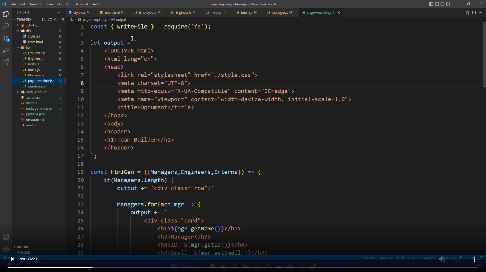

  # team-gen
  (https://img.shields.io/badge/license-mit-blue)
  ## Description
  
  - We can make simple yet clean html cards based on the users input on salary, name of worker, office number, and id.
  
  ## Installation
  
  node.js
  

  ## Email

  delgadojustin100@yahoo.com
  

  ## GitHub

  tydelgado98
  
  ## Credits
  
  Justin Delgado

  # Video
  
  
  ## License
  
  My license is the (https://choosealicense.com/licenses/mit) License